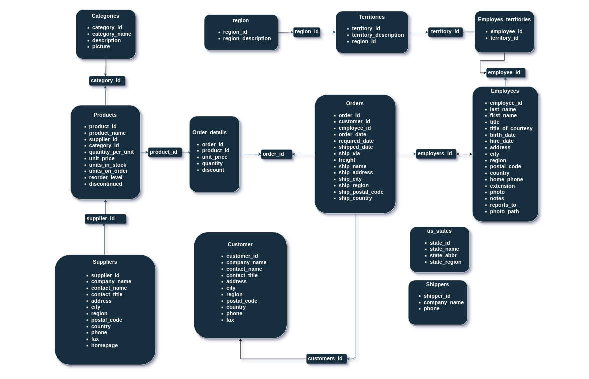
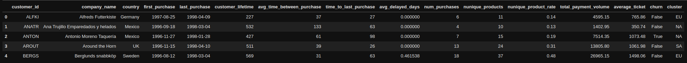

# NorthWind Traders

Fonte: RodReis, em Unsplash

---

## 1 - Business Problems ( Problemas de Negócio )

### 1.1 - Business Problems

**NorthWind Traders** is a fictional store that manages orders, products, customers, suppliers, and many other aspects of a small business. It has reports made on spreadsheets on demand.

When the company was small, this format worked, but now with the accelerated growth of the company, **data from different areas started to not match**, and meetings became more conflicting. The company also wants to better understand its data to **increase the average ticket** and **reduce churn** (two objectives considered strategic in the medium term).

### 1.3 - Sobre os dados

---
|SpreadSheets | Meaning |
| --- | --- |
| orders| A collection of records that represent purchase orders made by customers for specific products. |
| order_details| A collection of records that represent the individual line items in each purchase order, including details such as the product, quantity, and price. |
| products| A collection of records that represent the products available for purchase in the store, including details such as the product name, description, and price. |
| categories| A collection of records that categorize the products, providing an organizational structure for the store's inventory. |
| customer_customer_demo| A table that stores demographic information about the store's customers, such as age, income, and education level. |
| customer_demographics| A collection of records that define various demographic segments for customers, allowing for targeted marketing efforts. |
| customers| A collection of records that represent the store's customers, including details such as their name, address, and contact information. |
| employee_territories| A table that associates employees with specific sales territories, allowing for better management of sales efforts. |
| employees| A collection of records that represent the store's employees, including details such as their name, title, and contact information. |
| region| A collection of records that define various geographic regions, allowing for better management of sales efforts and reporting. |
| shippers| A collection of records that represent the various shipping companies the store uses to fulfill orders, including details such as their name and contact information. |
| suppliers| A collection of records that represent the various suppliers the store uses to purchase products, including details such as their name and contact information. |
| territories| A collection of records that define various sales territories, allowing for better management of sales efforts and reporting. |
| us_states| A collection of records that represent the various states in the US, allowing for better management of sales efforts and reporting based on location. |

---

## 2 - Solution Strategy ( Estratégia de Solução )

**CRISP-DM** stands for Cross Industry Standard Process for Data Mining, which can be translated as Standard Process for Inter-Industry Data Mining. It is a data mining process model that describes commonly used approaches by data mining experts to tackle problems.

As a basis for this project, we will use CRISP, and once the entire first cycle of CRISP is completed, we can make further iterations, create new features, generate new insights, and improve model performance, all to deliver more value to the company. It is also important to engage with stakeholders in the project throughout the process, to keep them informed and manage their expectations.

All codes and visualizations of this project can be followed in this [Notebook](Notebook.ipynb).

### 2.1 - Data Organizations Problem

1. As a way to better manage the data conflicts generated by the accelerated growth of the company, an Entity-Relationship Model (ERM) was developed so that different areas can have access to more accurate information.

2. Customer Dataframe: Information such as lifespan, churn, etc. was presented from data unions.
This data frame was created to analyze all customer information.

3. Order Order Dataframe: By unifying tables such as “order” and “order_details”, and generating new information from data combinations, an order data frame was created, facilitating data analysis.

### 3.2 - Exploratory Data Analysis

1. Descriptive statistics: allow us to identify patterns, relationships, and trends in the data, and to communicate these findings clearly and concisely.

**Mind Map of Hypotheses**

- Com o mapa mental criamos uma lista de hipóteses. Com objetivo de ver quanto a hipótese tem de impacto nas vendas.
- Novas features foram criadas, com objetivo de ajudar a visualizar tendências temporais, e também para auxiliar o modelo.

### 3.3 - Filtering Variables

- Foram retirados os dias que as lojas não estavam abertas, e dias que não foram realizadas vendas.
- Foram excluídas colunas que foram derivadas em outras variáveis no feature engineering.
- A coluna de customers foi retirada, pois não temos os dados de quantos clientes vão à loja nas próximas 6 semanas. No próximo ciclo do crisp, seria interessante fazer uma previsão de quantos clientes irão para a loja nas próximas semanas. Para então fazer uma previsão de vendas.

### 3.4 - Exploratory Data Analysis

**Univariate Analysis**:

- Observando o gráfico da variável resposta, percebemos que ela está com uma skew positiva ( figura 1 ). Multiplicando a variável resposta pelo log, ela fica com uma distribuição mais parecida com uma normal ( figura 2 ).

&nbsp;

- Plot de histogramas usando as variáveis numéricas, são observados alguns comportamentos relevantes que serão usados no modelo.
- Plot de gráficos de barras e linhas sobrepostas, para observar as variáveis categóricas.

**Bivariate Analysis**:

- Validação das hipóteses usando visualização de dados para entender a relação entre as variáveis e a variável resposta. Também com o objetivo de gerar insights.

**Multivariate Analysis**:

- Variáveis Numéricas: Plot de um heatmap com as correlações usando o método de Pearson.
- Variáveis Categóricas: Criei uma função para calcular o coeficiente de Cramer’s V em relação a duas variáveis. Depois é gerado um gráfico heatmap com todas as combinações.
  ( link da fonte: [ Cramer’s V - Wikipedia ](https://en.wikipedia.org/wiki/Cram%C3%A9r%27s_V) )

### 3.5 - Data Preparation

- Selecionando as variáveis de acordo com sua distribuição e escala, neste passo temos que preparar os dados. Como no conjunto de dados da Rossmann não há nenhum caso de normalização. Seguimos para o redimensionamento( rescaling ).
- No rescaling usamos o RobustScaler para variáveis com outliers, e o MinMaxScaler para variáveis com distribuições mais próximas de normais.
- Em transformação dividimos entre 3 grupos.
- No primeiro Encoding selecionamos as variáveis categóricas e aplicamos One Hot Encoding, Label Encoding e Ordinal Encoding de acordo com cada variável.
- Em Response Variable Transformation aplicamos o log1p( log transformation ), na variável resposta. Como vimos na análise da variável resposta, no passo acima ( Exploratory Data Analysis ), aplicando essa transformação de log, a variável resposta vai ter uma distribuição perto de uma normal.
- Por último, Nature Transformation( transformação de natureza ), selecionando as variáveis temporais, aplicamos um modelo de natureza cíclica.

### 3.6 - Feature Selection

- Como o objetivo do projeto e uma previsão de vendas das próximas 6 semanas, para a validação do modelo de machine learning, a divisão do dataset será as últimas 6 semanas para a validação, e o restante para treino.
- Selecionando as colunas com o algoritmo Boruta.
- Com o resultado do Boruta, comparo a relevância das features com a análise das hipóteses no passo 4. Com as features do Boruta e da análise de hipóteses, tenho as features que usarei nesse primeiro ciclo do CRISP.

### 3.7 - Machine Learning Modeling

- Para o primeiro ciclo do CRISP serão usados 5 modelos para criarmos valor para o negócio o mais rápido possível. Outros modelos podem ser testados nos próximos ciclos do CRISP.

1. **Average Model**: Modelo de média. Ele será usado para avaliar a performance dos demais modelos.
2. **Linear Regression Model**: A regressão linear modela a relação entre variáveis ​​ajustando uma equação linear aos dados observados.
3. **Lasso Regression Model**: Método de análise de regressão que realiza seleção e regularização de variáveis ​​para melhorar a precisão da previsão.
4. **Random Forest Regression Model**: Algoritmo que cria uma combinação (ensemble) de árvores de decisão.
5. **XGBoost Regression model**: Algoritmo de aprendizado de máquina, baseado em árvore de decisão e que utiliza uma estrutura de Gradient boosting.

> Os modelos lineares performaram pior que o modelo de média, isso demonstra o quão complexo são nossos dados.

- Ao construir um modelo, você precisa avaliar seu desempenho. E aqui estamos somente avaliando a performance nesse único período das 6 últimas semanas. Para uma melhor avaliação dos modelos utilizaremos um método conhecido como Cross Validation in Time Series ( Validação Cruzada em séries temporais ).

- A ideia para divisões de séries temporais é dividir o conjunto de treinamento em duas dobras a cada iteração, com a condição de que o conjunto de validação esteja sempre à frente do conjunto de treinamento. Na primeira iteração, treina-se o modelo com a primeira dobra, e usamos a dobra seguinte para validação, na segunda interação treina-se o modelo com a união da primeira e segunda dobra da primeira interação, e usamos a dobra seguinte para validação, assim sucessivamente até o final do conjunto de treinamento.

- Você precisa repetir essas etapas até testar seu modelo em cada uma das interações e suas métricas finais serão a média das pontuações obtidas em cada dobra.Isso permite que você evite o overfitting e avalie o desempenho do modelo ao longo do tempo.

&nbsp;

- Abaixo teremos o resultado dos modelos com a aplicação do Cross Validation:
  &nbsp;

> Apesar do modelo Random Forest ter o melhor resultado, o XGBosst foi escolhido para ser o modelo final, isso porque ele performa relativamente parecido com o Random Forest mas exige menos capacidade computacional. No dia a dia de um Cientista de Dados também é importante medir quanto os seus modelos gastam de capacidade computacional, para avaliar o custo para a empresa.

### 3.8 - Hyperparameter Fine Tuning

- Com o objetivo de selecionar os melhores hiperparâmetros para o modelo utilizaremos o método Random Search.
- No Random Search criamos um dicionário com alguns hiperparâmetros, e então serão treinados modelos com conjuntos desses hiperparâmetros selecionados aleatoriamente.
- Com o melhor resultado do Random Search treinamos novamente, e temos o seguinte resultado:

### 3.9 - Performance Evaluation

> Para modelos de regressão nos avaliamos usando o erro.

**Resultado das predições em relação às vendas ao longo das últimas 6 semanas.**

&nbsp;

**Taxa de erro ao longo das últimas 6 semanas.**

&nbsp;

**Distribuição do erro.**

&nbsp;

**Previsões em relação ao erro.**

&nbsp;

- **Best and Worst Case Scenario**:
  - Foi calculado o melhor e o pior cenário para cada previsão.

> O conjunto de dados com as previsões de cenário podem ser acessados neste documento. [Predictions Scenario](predictions_scenario.csv)

### 3.10 - Model Deployment

- Para melhor atender o CFO da Rossmann será criado um bot no Telegram. Usando Flask e o server do Heroku construiremos o bot para ser acessado em qualquer lugar pelo CFO desde que ele tenha uma conexão com a internet.

**Arquitetura do bot**

&nbsp;

**Telegram bot**:

> Ao iniciar o chat com o bot, basta enviar o número de uma loja, que você receberá as previsões. Lembrando que no caso de não existir a loja no conjunto de dados, você receberá a mensagem "Store Not Available".

Você pode acessar o bot através desse link: [Telegram Bot](https://t.me/RossmannSalesPredictionBot)

Ou através deste QRCode:

## 4 - Conclusions ( Conclusões )

- Com o método CRISP conseguimos entregar valor o mais rápido possível para a empresa. E se precisar, podemos fazer mais ciclos para melhorar a performance do modelo.
- Com Exploratory Data Analysis ( Análise exploratória de dados ) podemos validar hipóteses, gerar insights e conhecer melhor nosso conjunto de dados. Sendo uma das etapas mais importantes do CRISP.
- Modelos de Machine Learning tem melhor performance do que os métodos tradicionais.

## 5 - Next Steps to Improve ( Próximos passos )

No próximo ciclo do CRISP podemos:

- Criar novas features com o objetivo de melhorar a performance do modelo.
- Avaliar novas hipóteses, e validar a hipótese 5.
- Criar um modelo de previsão de quantos clientes irão à loja nas próximas 6 semanas.
- Para lojas em que as previsões tiveram performances ruins, testar outros modelos e hiperparâmetros, a fim de melhorar a taxa de erro.
- Outra versão do bot do telegram, com novas funções, como mostrar pior e melhor cenário, e gráficos.

## 6 - Technologies ( Tecnologias )

## 7 - Author

Lucas da Cunha
Data Scientist em formação

[Portfolio de Projetos](https://jlcunha.github.io/portfolio_projetos/)

[GitHub Profile](https://github.com/jlcunha/)
